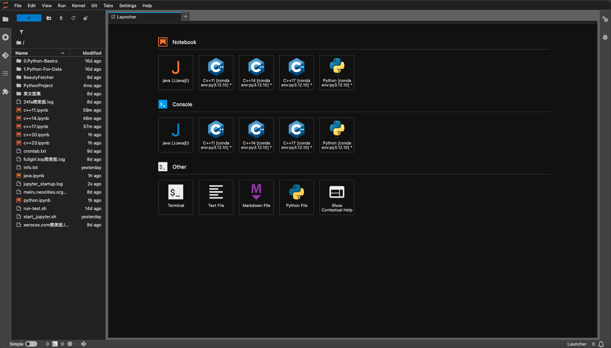
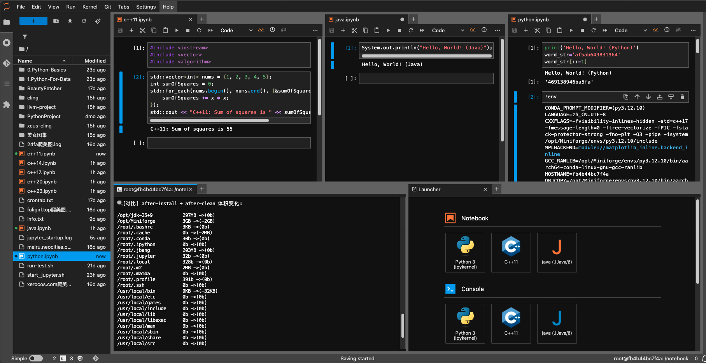
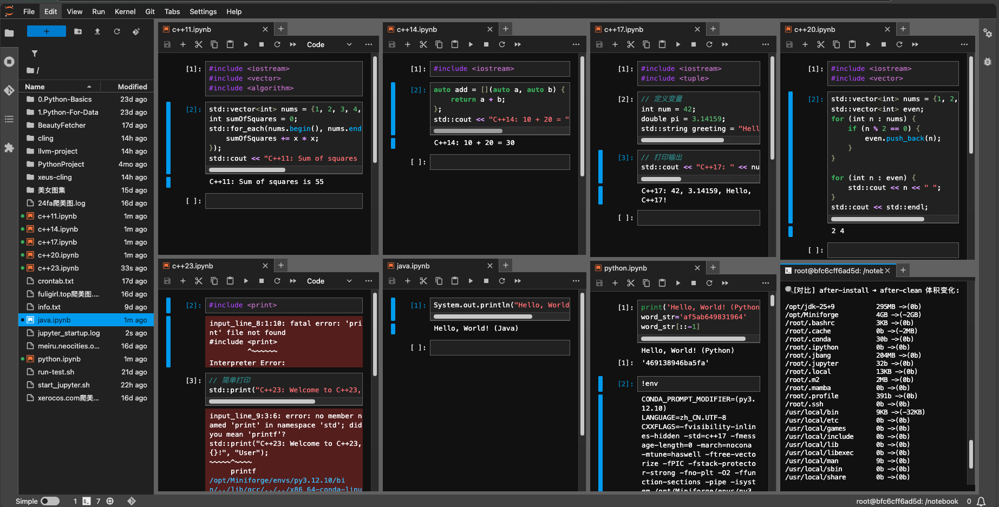

# docker-arch-miniforge-jupyter
miniforge 安装 jupyter notebook 封装特殊需求自用 python 测试容器 
本项目通过 Docker 构建了一个多内核 Jupyter 环境，集成了 Python、C++ 和 Java（jdk 25）的内核。项目基于 Miniforge 构建，并通过自动化脚本完成各项配置（如 Jupyter 自动配置、默认密码、终端、主题等）。



    
<a href="https://star-history.com/#469138946ba5fa/docker-arch-miniforge-jupyter&Date">
  <picture>
    <source media="(prefers-color-scheme: dark)" srcset="https://api.star-history.com/svg?repos=469138946ba5fa/docker-arch-miniforge-jupyter&type=Date&theme=dark" />
    <source media="(prefers-color-scheme: light)" srcset="https://api.star-history.com/svg?repos=469138946ba5fa/docker-arch-miniforge-jupyter&type=Date" />
    
  </picture>
</a>

## 目录结构

项目工作目录如下：

```
.
├── .env.amd64                 # Docker Compose 配置文件所需 amd64 环境，需要更名为 .env 使用
├── .env.arm64                 # Docker Compose 配置文件所需 arm64 环境，需要更名为 .env 使用
├── docker-compose.yml         # Docker Compose 配置文件，用于多容器编排（例如搭配其它服务时使用）
├── Dockerfile                 # 构建 Docker 镜像的说明文件
├── LICENSE                    # 许可协议文件
├── README.md                  # 本项目说明文档
└── scripts                    # 脚本目录，包含各项自动化安装和启动脚本
    ├── analyze_size.sh        # 日志记录点，虽跳出三界外不在五行中，但却在道之内，为精简优化镜像提供参考
    ├── clean.sh               # 清理构建产物或停止容器的脚本
    ├── common.sh              # 通用日志、函数等辅助脚本
    ├── init_system.sh         # 系统初始化脚本（例如配置 locale、环境变量等）
    ├── install_jbang.sh       # 安装 jbang（用于 Java 工具链）的脚本
    ├── install_jdk.sh         # 安装 JDK 环境的脚本
    ├── install_jupyter.sh     # 安装并配置 Jupyter（包括内核、密码、默认终端/主题）的脚本
    ├── install_miniforge.sh   # 安装 Miniforge 的脚本，用于创建 conda 环境
    └── start_jupyter.sh       # 启动 Jupyter 服务的脚本
```

## 特点

- **多语言支持**  
  - Python 内核  
  - C++ 内核：默认提供 C++11、C++14、C++17 内核，手动修改配置后可以扩展支持 C++20/23，发现通过调整不同的安装方式可以解决过去的某些崩溃问题，但不是全部问题
  - Java 内核：通过 jbang 与 Java（jdk 25）部署相应内核。

- **自动化配置**  
  - 自动生成 Jupyter 配置文件（`jupyter_server_config.py`、用户覆盖设置），设置默认密码、默认终端（`/bin/bash`）及黑暗主题。  
  - 脚本化安装与构建，确保在非交互式 Docker 环境中稳定运行。

- **数据科学支持**  
  包含多个常用数据科学和开发工具包（例如 numpy、pandas、jupyter_contrib_nbextensions 等），以满足开发与实验需求。

## 快速入门

### 通过 docker-compose 文件启动（如果你在 docker-compose.yml 中配置了服务）：

根据你的系统cpu架构选择正确的环境文件比如 .env.arm64 修改完善后，改名为 .env 以支持 docker-compose.yml 文件

```bash
docker-compose up -d
```

### 通过 docker 启动 Jupyter 服务

项目中通过 `tini` 执行 `start_jupyter.sh` 启动 Jupyter 服务。你可以直接进入容器后执行脚本，或在 Docker Compose 设置中指定此命令。启动后，服务默认监听 8888 端口。

例如，通过 docker 运行容器：

```bash
# 后台运行
# --rm 不能和 --restart=always 一起用，这是两个相反的命令
# 要么用 --rm 容器终止即删除
# 要么用 --restart=always 容器中断自动重启
docker run --restart=always \
  --name miniforge_jupyter_container \
  -it -d \
  -p 8888:8888 \
  -e JUPYTER_PASSWORD=123456 \
  -v "./jupyter/notebook:/notebook" \
  -v "./jupyter/.jupyter:/root/.jupyter" \
  ghcr.io/469138946ba5fa/docker-arch-miniforge-jupyter:latest \
  sh -c "tini -- /usr/local/bin/start_jupyter.sh"

# 查看日志
docker logs -f miniforge_jupyter_container

# 终止容器
docker stop miniforge_jupyter_container

# 删除容器
docker rm -fv miniforge_jupyter_container
```

### 访问 JupyterLab

在浏览器中打开 `http://localhost:8888`，按照 .env 配置文件中设置的密码或者 `123456` 登录。

### 密码修改
在浏览器中打开 `http://localhost:8888`，登陆，打开 `terminal` 终端
执行以下命令，并输入两次密码(不会显示字符)，重启容器完成密码修改
```shell
# 修改密码
jupyter notebook password
# 重启容器
docker-compose restart
```

### 测试内核

在 Jupyter Notebook 中，新建 Notebook 时，可以选择不同的内核（例如 Python Java C++11）。可将以下代码分别粘贴到不同内核 ipynb 页面的 cell 中测试：

- **Python 示例**

  ```python
  print('Hello, World! (Python)')
  word_str='af5ab649831964'
  word_str[::-1]
  ```

- **Java 示例**

  ```java
  System.out.println("Hello, World! (Java)");
  ```

在使用 C++ 内核时，需注意以下事项：

1. **清理内核以避免变量冲突报错**：
   - 频繁测试代码时，建议经常清理内核。
   - 重复执行同一个 cell 会导致变量名重复定义，因为 Jupyter 会存储这些变量。

2. **代码组织建议**：
   - 将不同功能的代码分离到不同的 cell 中按顺序执行。例如：
     - **头文件引用**：放入一个单独的 cell，仅需执行一次。
     - **变量定义**：放入一个单独的 cell，仅需执行一次。
     - **代码逻辑执行**：放入一个单独的 cell，可多次执行。

3. **使用独特变量名称**：尽量避免变量名重复，这是减少冲突的好习惯。

4. **解决报错的方法**：
   - 点击菜单中的 **"内核" -> "重新启动并清除输出"** 来清理之前定义的变量。
   - 然后重新运行需要的代码。

- **C++11 示例**

  ```cpp
  #include <iostream>
  #include <vector>
  #include <algorithm>

  std::vector<int> nums = {1, 2, 3, 4, 5};
  int sumOfSquares = 0;
  std::for_each(nums.begin(), nums.end(), [&sumOfSquares](int x) {
      sumOfSquares += x * x;
  });
  std::cout << "C++11: Sum of squares is " << sumOfSquares << std::endl;
  ```

- **C++14 示例**

  ```cpp
  #include <iostream>
  auto add = [](auto a, auto b) {
      return a + b;
  };
  std::cout << "C++14: 10 + 20 = " << add(10, 20) << std::endl;
  ```

- **C++17 示例**
  ```cpp
  #include <iostream>
  #include <tuple>

  std::tuple<int, double, std::string> data = {42, 3.14, "Hello C++17"};
  auto [num, pi, greeting] = data;
  std::cout << "C++17: " << num << ", " << pi << ", " << greeting << std::endl;
  ```

- **C++20 示例（手动复制 C++17 内核为 C++20 并修改 kernel.json 替换内容 17 为 20 后使用）**

  ```cpp
  #include <iostream>
  #include <vector>
  #include <ranges>

  std::vector<int> v = {1, 2, 3, 4, 5};
  auto squares = v | std::views::transform([](int x) { return x * x; });
  std::cout << "C++20: Squares: ";
  for (auto s : squares) {
      std::cout << s << " ";
  }
  std::cout << std::endl;
  ```

- **C++23 示例（手动复制 C++20 内核为 C++23 并修改 kernel.json 替换内容 20 为 23 后使用）**

  ```cpp
  #include <print>

  // 简单打印
  std::print("C++23: Welcome to C++23, {}!", "User");
  ```

## 已知问题与调试
- arm64 架构镜像 C++14/17/20/23 崩溃，大概是官方对arm64架构的处理器支持不够完善，所以被我手动剔除了，如图：


- amd64 架构镜像 C++23 崩溃，大概是官方对amd64处理器支持不够用完善，但是我觉得有研究价值所以保留了，如图：


- 若 Jupyter 配置（密码、默认终端或主题）未生效，请检查容器启动日志中是否正确生成 `~/.jupyter` 下的配置文件。
- 容量太大，个人学习使用还可以，共享出来也少有人能用上，构建出这么大的镜像不如安装到本机

## 定制与扩展

- 如果你需要添加新的内核或者修改现有内核配置，请参考 `scripts/install_jupyter.sh` 中的自动化配置逻辑。  
- 更多配置项可参见 [Jupyter 官方文档](https://docs.jupyter.org/en/latest/index.html)，结合项目需求进行扩展。

## 构建 Docker 镜像

你可能需要一些前置条件，比如 docker compose buildx 环境的部署
稍微说一下吧，点到为止  
比如我的机器是 Ubuntu 24.04 LTS (GNU/Linux 6.8.0-57-generic aarch64)

  - **docker 部署过程如下：**

```shell
# 系统可以使用官方一键安装脚本 https://github.com/docker/docker-install
curl -fsSL https://test.docker.com -o test-docker.sh
sh test-docker.sh
# Manage Docker as a non-root user
## 非 root 用户需要加入到 docker 组才有权限使用
# Create the docker group
## 添加 docker 组
sudo groupadd docker
# Add your user to the docker group.
## 将当前用户加入到 docker 组权限
sudo usermod -aG docker ${USER}
# Log out and log back in so that your group membership is re-evaluated.
## 临时进入 docker 组测试，更好的方式是退出并重新登录测试
newgrp docker 
# Configure Docker to start on boot
# 启用 docker 开机自启动服务
sudo systemctl enable docker.service
sudo systemctl enable containerd.service
# satrt
# 开启 docker 服务，其实上一步就启用了
sudo systemctl start docker.service
sudo systemctl start containerd.service
# Verify that Docker Engine is installed correctly by running the hello-world image
# 测试 docker hello-world:latest 打印
docker run --rm hello-world:latest
```

  - **compose 部署更新过程如下：**

```shell
# GitHub 项目 URI
URI="docker/compose"

# 获取最新版本
VERSION=$(curl -sL "https://github.com/${URI}/releases" | grep -Eo '/releases/tag/[^"]+' | awk -F'/tag/' '{print $2}' | head -n 1)
echo "Latest version: ${VERSION}"

# 获取操作系统和架构信息
OS=$(uname -s)
ARCH=$(uname -m)

# 映射平台到官方命名
case "${OS}" in
  Linux)
    PLATFORM="linux"
    if [[ "${ARCH}" == "arm64" || "${ARCH}" == "aarch64" ]]; then
      ARCH="aarch64"
    elif [[ "${ARCH}" == "x86_64" ]]; then
      ARCH="x86_64"
    else
      echo "Unsupported architecture: ${ARCH}"
      echo 'should exit 1'
    fi
    ;;
  *)
    echo "Unsupported OS: ${OS}"
    echo 'should exit 1'
    ;;
esac

# 输出最终平台和架构
echo "Platform: ${PLATFORM}"
echo "Architecture: ${ARCH}"

# 拼接下载链接和校验码链接
TARGET_FILE="docker-compose-${PLATFORM}-${ARCH}"
SHA256_FILE="${TARGET_FILE}.sha256"
URI_DOWNLOAD="https://github.com/${URI}/releases/download/${VERSION}/${TARGET_FILE}"
URI_SHA256="https://github.com/${URI}/releases/download/${VERSION}/${SHA256_FILE}"
echo "Download URL: ${URI_DOWNLOAD}"
echo "SHA256 URL: ${URI_SHA256}"

# 检查文件是否存在
if [[ -f "/tmp/${TARGET_FILE}" ]]; then
  echo "File already exists: /tmp/${TARGET_FILE}"
  
  # 删除旧的 SHA256 文件（如果存在）
  if [[ -f "/tmp/${SHA256_FILE}" ]]; then
    echo "Removing old SHA256 file: /tmp/${SHA256_FILE}"
    rm -fv "/tmp/${SHA256_FILE}"
  fi

  # 下载新的 SHA256 文件
  echo "Downloading SHA256 file..."
  curl -L -C - --retry 3 --retry-delay 5 --progress-bar -o "/tmp/${SHA256_FILE}" "${URI_SHA256}"

  # 校验文件完整性
  # shasum 校验依赖 perl 可能 linux 系统需要手动安装
  echo "Verifying file integrity for /tmp/${TARGET_FILE}..."
  cd /tmp
  if ! shasum -a 256 -c "${SHA256_FILE}"; then
    log_warning "SHA256 checksum failed. Removing file and retrying..."
    rm -fv "/tmp/${TARGET_FILE}"
  else
    echo "File integrity verified successfully."
  fi
fi

# 如果文件不存在或之前校验失败
if [[ ! -f "/tmp/${TARGET_FILE}" ]]; then
  echo "Downloading file..."
  curl -L -C - --retry 3 --retry-delay 5 --progress-bar -o "/tmp/${TARGET_FILE}" "${URI_DOWNLOAD}"

  # 删除旧的 SHA256 文件并重新下载
  if [[ -f "/tmp/${SHA256_FILE}" ]]; then
    echo "Removing old SHA256 file: /tmp/${SHA256_FILE}"
    rm -fv "/tmp/${SHA256_FILE}"
  fi
  echo "Downloading SHA256 file..."
  curl -L --progress-bar -o "/tmp/${SHA256_FILE}" "${URI_SHA256}"

  # 校验完整性
  # shasum 校验依赖 perl 可能 linux 系统需要手动安装
  echo "Verifying file integrity for /tmp/${TARGET_FILE}..."
  cd /tmp
  if ! shasum -a 256 -c "${SHA256_FILE}"; then
    echo "Download failed: SHA256 checksum does not match."
    echo 'should exit 1'
  else
    echo "File integrity verified successfully."
  fi
fi

sudo mv -fv "/tmp/${TARGET_FILE}" /usr/local/bin/docker-compose
# Apply executable permissions to the binary
## 赋予执行权
sudo chmod -v +x /usr/local/bin/docker-compose
# create a symbolic link to /usr/libexec/docker/cli-plugins/
# 创建插件目录和软链接
sudo mkdir -pv /usr/libexec/docker/cli-plugins/
sudo ln -sfv /usr/local/bin/docker-compose /usr/libexec/docker/cli-plugins/docker-compose
# Test the installation.
## 测试版本打印
docker-compose version
docker compose version
```

  - **buildx 部署更新过程如下：**

```shell
# GitHub 项目 URI
URI="docker/buildx"

# 获取最新版本
VERSION=$(curl -sL "https://github.com/${URI}/releases" | grep -Eo '/releases/tag/[^"]+' | awk -F'/tag/' '{print $2}' | head -n 1)
echo "Latest version: ${VERSION}"

# 获取操作系统和架构信息
OS=$(uname -s)
ARCH=$(uname -m)

# 映射平台到官方命名
case "${OS}" in
  Linux)
    PLATFORM="linux"
    if [[ "${ARCH}" == "arm64" || "${ARCH}" == "aarch64" ]]; then
      ARCH="arm64"
    elif [[ "${ARCH}" == "x86_64" ]]; then
      ARCH="amd64"
    else
      echo "Unsupported architecture: ${ARCH}"
      echo 'should exit 1'
    fi
    ;;
  *)
    echo "Unsupported OS: ${OS}"
    echo 'should exit 1'
    ;;
esac

# 输出最终平台和架构
echo "Platform: ${PLATFORM}"
echo "Architecture: ${ARCH}"

# 拼接下载链接和校验码链接
TARGET_FILE="buildx-${VERSION}.${PLATFORM}-${ARCH}"
SHA256_FILE="${TARGET_FILE}.sbom.json"
URI_DOWNLOAD="https://github.com/${URI}/releases/download/${VERSION}/${TARGET_FILE}"
URI_SHA256="https://github.com/${URI}/releases/download/${VERSION}/${SHA256_FILE}"
echo "Download URL: ${URI_DOWNLOAD}"
echo "SHA256 URL: ${URI_SHA256}"

# 检查文件是否存在
if [[ -f "/tmp/${TARGET_FILE}" ]]; then
  echo "File already exists: /tmp/${TARGET_FILE}"
  
  # 删除旧的 SHA256 文件（如果存在）
  if [[ -f "/tmp/${SHA256_FILE}" ]]; then
    echo "Removing old SHA256 file: /tmp/${SHA256_FILE}"
    rm -fv "/tmp/${SHA256_FILE}"
  fi

  # 下载新的 SHA256 文件
  echo "Downloading SHA256 file..."
  curl -L -C - --retry 3 --retry-delay 5 --progress-bar -o "/tmp/${SHA256_FILE}" "${URI_SHA256}"
  # 提取校验码
  CHECKSUM=$(cat "/tmp/${SHA256_FILE}" | jq -r --arg filename "${TARGET_FILE}" '.subject[] | select(.name == $filename) | .digest.sha256')
  # 将校验码写入源文件
  echo "${CHECKSUM} *${TARGET_FILE}" > "/tmp/${SHA256_FILE}"
  echo "校验码 ${CHECKSUM} 已写入文件: /tmp/${SHA256_FILE}"

  # 校验文件完整性
  # shasum 校验依赖 perl 可能 linux 系统需要手动安装
  echo "Verifying file integrity for /tmp/${TARGET_FILE}..."
  cd /tmp
  if ! shasum -a 256 -c "${SHA256_FILE}"; then
    log_warning "SHA256 checksum failed. Removing file and retrying..."
    rm -fv "/tmp/${TARGET_FILE}"
  else
    echo "File integrity verified successfully."
  fi
fi

# 如果文件不存在或之前校验失败
if [[ ! -f "/tmp/${TARGET_FILE}" ]]; then
  echo "Downloading file..."
  curl -L -C - --retry 3 --retry-delay 5 --progress-bar -o "/tmp/${TARGET_FILE}" "${URI_DOWNLOAD}"

  # 删除旧的 SHA256 文件并重新下载
  if [[ -f "/tmp/${SHA256_FILE}" ]]; then
    echo "Removing old SHA256 file: /tmp/${SHA256_FILE}"
    rm -fv "/tmp/${SHA256_FILE}"
  fi
  echo "Downloading SHA256 file..."
  curl -L --progress-bar -o "/tmp/${SHA256_FILE}" "${URI_SHA256}"
  # 提取校验码
  CHECKSUM=$(cat "/tmp/${SHA256_FILE}" | jq -r --arg filename "${TARGET_FILE}" '.subject[] | select(.name == $filename) | .digest.sha256')
  # 将校验码写入源文件
  echo "${CHECKSUM} *${TARGET_FILE}" > "/tmp/${SHA256_FILE}"
  echo "校验码 ${CHECKSUM} 已写入文件: /tmp/${SHA256_FILE}"

  # 校验完整性
  # shasum 校验依赖 perl 可能 linux 系统需要手动安装
  echo "Verifying file integrity for /tmp/${TARGET_FILE}..."
  cd /tmp
  if ! shasum -a 256 -c "${SHA256_FILE}"; then
    echo "Download failed: SHA256 checksum does not match."
    echo 'should exit 1'
  else
    echo "File integrity verified successfully."
  fi
fi

sudo mv -fv "/tmp/${TARGET_FILE}" /usr/local/bin/docker-buildx
# Apply executable permissions to the binary
## 赋予执行权
sudo chmod -v +x /usr/local/bin/docker-buildx
# create a symbolic link to /usr/libexec/docker/cli-plugins/
# 创建插件目录和软链接
sudo mkdir -pv /usr/libexec/docker/cli-plugins/
sudo ln -sfv /usr/local/bin/docker-buildx /usr/libexec/docker/cli-plugins/docker-buildx
# Test the installation.
## 测试版本打印
docker-buildx version
docker buildx version
```

  - **docker buildx build 在项目目录下执行构建镜像具体流程命令 ：**

```shell
# docker proxy pull
## 配置 docker 代理，比如 http://192.168.255.253:7890
sudo mkdir -pv /etc/systemd/system/docker.service.d
cat << '469138946ba5fa' | sudo tee /etc/systemd/system/docker.service.d/http-proxy.conf
[Service]
Environment="HTTP_PROXY=http://192.168.255.253:7890"
Environment="HTTPS_PROXY=http://192.168.255.253:7890"
Environment="NO_PROXY=localhost,127.0.0.1,192.168.255.0/24"
469138946ba5fa
sudo systemctl daemon-reload
sudo systemctl restart docker
sudo systemctl show --property=Environment docker

# docker login & config
## 使用 github 具有上传下载镜像权限 [write:packages(read:packages)] 的 token 登陆 github 并预配置用户和目录参数
echo '请输入具有上传下载镜像权限 [write:packages(read:packages)] 的 github token (不会显示输入内容):' ; read -sr GITHUB_TOKEN
echo '请输入 github 用户名(为空则默认是 469138946ba5fa ):' ; read -r USERNAME
echo '请输入你的 github 镜像存储源(为空则默认是 ghcr.io ):' ; read -r DOCKER_DOMAIN
echo '请输入 docker 项目存放的父目录(为空则默认目录 /media/psf/KingStonSSD1T/docker-workspace ):' ; read -r CUSTOM_DIR
echo '请输入你的 docker 项目名(为空则默认是我的仓库名即 docker-arch-miniforge-jupyter ):' ; read -r REPO
echo '请输入你的 docker buildx 构建可能需要的大缓存存储目录(为空则默认目录 /media/psf/KingStonSSD1T/docker_buildx.cache ):' ; read -r BUILDX_CACHE

## 执行登陆和变量赋值解除
USERNAME=${USERNAME:-469138946ba5fa}
DOCKER_DOMAIN=${DOCKER_DOMAIN:-ghcr.io}
echo ${GITHUB_TOKEN} | docker login ${DOCKER_DOMAIN} -u ${USERNAME} --password-stdin ; unset GITHUB_TOKEN
CUSTOM_DIR=${CUSTOM_DIR:-'/media/psf/KingStonSSD1T/docker-workspace'}
REPO=${REPO:-docker-arch-miniforge-jupyter}
BUILDX_CACHE=${BUILDX_CACHE:-'/media/psf/KingStonSSD1T/docker_buildx.cache'}

## 创建缓存目录和新缓存目录
mkdir -pv ${BUILDX_CACHE}
mkdir -pv ${BUILDX_CACHE}-new
echo ${USERNAME}
echo ${DOCKER_DOMAIN}
echo ${CUSTOM_DIR}/${REPO}
echo ${BUILDX_CACHE}
echo ${BUILDX_CACHE}-new

## 进入到项目目录
cd ${CUSTOM_DIR}/${REPO}

# stop and remove containerd
## 停止并移除当前运行容器
docker-compose stop
docker-compose rm -fv

# delete image tag
## 删除当前镜像，如果需要可以解除注释粘贴执行
#docker rmi ${DOCKER_DOMAIN}/${USERNAME}/${REPO}:latest

# All emulators:
## 多架构跨平台环境虚拟
docker run --privileged --rm tonistiigi/binfmt:master --install all
# Show currently supported architectures and installed emulators
docker run --privileged --rm tonistiigi/binfmt:master

# docker buildx 
## 使用 docker buildx 构建单/多架构镜像
# buildx create
## 创建 buildx 构建节点并启用查看信息
#docker-buildx create --use
docker-buildx create --name ${REPO} --use
docker-buildx inspect --bootstrap

#  说明：
#  --platform linux/arm64/v8,linux/amd64 表示构建多个平台的镜像。
#  --tag 参数根据你自己的环境变量（例如 DOCKER_DOMAIN、USERNAME、REPO）设置镜像名称。
#  --no-cache 选项来避免使用过多的缓存，不要与 --cache-from 和 --cache-to 合用
#  --cache-from 从 ${BUILDX_CACHE} 目录中加载缓存数据，加速构建。
#  --cache-to 将新生成的缓存数据写入到 ${BUILDX_CACHE}-new 目录中。
#  --label 添加单镜像标签应该和 Dockerfile 中的 LABEL 等效
#  --load 表示将构建完成的镜像加载到 Docker 本地镜像库中（对于跨平台构建，注意在某些情况下可能只能加载当前体系结构的镜像）。
#  --push 表示将构建完成的镜像推送到 Docker 远端镜像库中 
#  --output 导出器以下是type参数信息
#    type=image 导出类型为镜像
#    name=ghcr.io/469138946ba5fa/docker-arch-test:latest 镜像名
#    compression=zstd 压缩类型 zstd 也支持 gzip 和 estargz
#    compression-level=22 设置 zstd 压缩级别为 22 ，gzip 和 estargz 的范围是 0-9 ， zstd 的范围是 0-22
#    force-compression=true 强制重压缩
#  最近发现对于多架构镜像需要额外在 --output 中配置多架构标签属性 --label 仅适用于单架构情况 https://docs.github.com/en/packages/working-with-a-github-packages-registry/working-with-the-container-registry#adding-a-description-to-multi-arch-images
#  --output 
#    annotation-index.org.opencontainers.image.description='' 多架构镜像注释标签
#    annotation-index.org.opencontainers.image.title='' 多架构镜像标题标签
#    annotation-index.org.opencontainers.image.version='' 多架构镜像版本标签
#    annotation-index.org.opencontainers.image.authors='' 多架构镜像作者标签
#    annotation-index.org.opencontainers.image.source='' 多架构镜像关联仓库标签
#    annotation-index.org.opencontainers.image.licenses='' 多架构镜像协议标签
#  最近发现云端镜像仓库有 unknown/unknown 未识别架构的问题，如下方案可以规避云端仓库 https://github.com/docker/buildx/issues/1964#issuecomment-1644634461
#  --output 导出器 type=oci-mediatypes=false 关闭OCI索引，然而失败了☹️，unknown/unknown 显示问题存在
#  --provenance=false 设置为不生成来源信息，但禁用 provenance 信息，意味着你失去了有关构建过程的详细记录和签名。这对追踪镜像的安全性和来源可能会有一些影响，可以解决 unknown/unknown 显示问题
#  参考 https://docs.docker.com/build/building/variables/#buildx_no_default_attestations
#  export BUILDX_NO_DEFAULT_ATTESTATIONS=1 添加环境变量禁用来源证明应该和 --provenance=false 等效，也可以解决 unknown/unknown 显示问题
#  综上，我觉得 unknown/unknown 也可以接受，就这样吧

# buildx build load
## 单架构本地存储，比如 linux/arm64/v8 ，压缩生成镜像
docker buildx build \
  --platform linux/arm64/v8 \
  --cache-from type=local,src=${BUILDX_CACHE} \
  --cache-to type=local,dest=${BUILDX_CACHE}-new,mode=max \
  --output type=image,name=${DOCKER_DOMAIN}/${USERNAME}/${REPO}:latest,compression=zstd,compression-level=22,force-compression=true \
  --tag ${DOCKER_DOMAIN}/${USERNAME}/${REPO}:latest \
  --load .

# docker-compose test
## docker-compose 运行测试
docker-compose stop
docker-compose rm -fv
docker-compose up -d --force-recreate
## 容器日志 ctrl+c 退出
docker-compose logs -f
## 容器状态监控 ctrl+c 退出
docker-compose stats

# buildx build push
## 多架构上传仓库，比如 linux/arm64/v8,linux/amd64，去除oci索引，防止 unknown/unknown
## 正常构建镜像会很大，但是时间很短，上传会浪费大量带宽
# buildx build push
## 多架构上传仓库，比如 linux/arm64/v8,linux/amd64
## 正常构建镜像会很大，但是时间很短，上传会浪费大量带宽
docker buildx build \
  --platform linux/arm64/v8,linux/amd64 \
  --cache-from type=local,src=${BUILDX_CACHE} \
  --cache-to type=local,dest=${BUILDX_CACHE}-new,mode=max \
  --output type=image,name=${DOCKER_DOMAIN}/${USERNAME}/${REPO}:latest,\
annotation-index.org.opencontainers.image.description='miniforge 安装 jupyter notebook 封装特殊需求自用 python 测试容器，支持 amd64 和 arm64/v8 架构.',\
annotation-index.org.opencontainers.image.title='Miniforge Jupyter',\
annotation-index.org.opencontainers.image.version='1.0.0',\
annotation-index.org.opencontainers.image.authors='469138946ba5fa <af5ab649831964@gmail.com>',\
annotation-index.org.opencontainers.image.source='https://github.com/469138946ba5fa/docker-arch-miniforge-jupyter',\
annotation-index.org.opencontainers.image.licenses='MIT' \
  --push .

## 或者多架构上传仓库，比如 linux/arm64/v8,linux/amd64，压缩
## 但压缩会意味着浪费更多的时间，但是也许会节省带宽，然而我并不清楚压缩和正常构建之间的关系
docker buildx build \
  --platform linux/arm64/v8,linux/amd64 \
  --cache-from type=local,src=${BUILDX_CACHE} \
  --cache-to type=local,dest=${BUILDX_CACHE}-new,mode=max \
  --output type=image,name=${DOCKER_DOMAIN}/${USERNAME}/${REPO}:latest,compression=zstd,compression-level=22,force-compression=true,\
annotation-index.org.opencontainers.image.description='miniforge 安装 jupyter notebook 封装特殊需求自用 python 测试容器，支持 amd64 和 arm64/v8 架构.',\
annotation-index.org.opencontainers.image.title='Miniforge Jupyter',\
annotation-index.org.opencontainers.image.version='1.0.0',\
annotation-index.org.opencontainers.image.authors='469138946ba5fa <af5ab649831964@gmail.com>',\
annotation-index.org.opencontainers.image.source='https://github.com/469138946ba5fa/docker-arch-miniforge-jupyter',\
annotation-index.org.opencontainers.image.licenses='MIT' \
  --push .

## 或者多架构上传仓库，比如 linux/arm64/v8,linux/amd64，压缩，不生成镜像来源，防止 unknown/unknown
## 使用 export BUILDX_NO_DEFAULT_ATTESTATIONS=1 或 --provenance=false 禁用来源信息，意味着你失去了有关构建过程的详细记录和签名。这对追踪镜像的安全性和来源可能会有一些影响。
#export BUILDX_NO_DEFAULT_ATTESTATIONS=1
docker buildx build \
  --platform linux/arm64/v8,linux/amd64 \
  --cache-from type=local,src=${BUILDX_CACHE} \
  --cache-to type=local,dest=${BUILDX_CACHE}-new,mode=max \
  --output type=image,name=${DOCKER_DOMAIN}/${USERNAME}/${REPO}:latest,compression=zstd,compression-level=22,force-compression=true,\
annotation-index.org.opencontainers.image.description='miniforge 安装 jupyter notebook 封装特殊需求自用 python 测试容器，支持 amd64 和 arm64/v8 架构.',\
annotation-index.org.opencontainers.image.title='Miniforge Jupyter',\
annotation-index.org.opencontainers.image.version='1.0.0',\
annotation-index.org.opencontainers.image.authors='469138946ba5fa <af5ab649831964@gmail.com>',\
annotation-index.org.opencontainers.image.source='https://github.com/469138946ba5fa/docker-arch-miniforge-jupyter',\
annotation-index.org.opencontainers.image.licenses='MIT' \
  --provenance=false \
  --push .
#unset BUILDX_NO_DEFAULT_ATTESTATIONS

# 查看 Docker 镜像元数据信息
docker inspect ${DOCKER_DOMAIN}/${USERNAME}/${REPO}:latest
# 查看 Docker 镜像清单（Manifest）。JSON 格式 Docker 镜像清单包含了有关镜像的元数据，包括层（layers）、架构（architecture）、操作系统（OS）、标签（tags）等信息
docker manifest inspect ${DOCKER_DOMAIN}/${USERNAME}/${REPO}:latest
# 启用调试模式后，命令会输出更多的详细信息，包括 Docker 连接的网络请求、API 调用等
docker --debug manifest inspect ${DOCKER_DOMAIN}/${USERNAME}/${REPO}:latest

# delete buildx cache dir
## 删除 docker buildx 所使用的大存储缓存目录，你也可以留着
rm -frv ${BUILDX_CACHE}

# create new buildx cache dir
## 使用  docker buildx 新的缓存替换旧缓存
mv -fv ${BUILDX_CACHE}-new ${BUILDX_CACHE}
mkdir -pv  ${BUILDX_CACHE}-new

## 清理 buildx 构建缓存。以及清理构建新镜像所产生的 <none> 标签老镜像
docker builder prune -af
docker rmi $(docker images -qaf dangling=true)

# docker build clean
## 清理所有停止的容器
#docker container prune -f
## 清理未使用的镜像
#docker image prune -af
## 清理不使用的网络
#docker network prune -f
## 清理不使用的卷
#docker volume prune -af
## 清理所有不需要的数据: 如果想要彻底清理所有未使用的镜像、容器、网络和卷，可以使用
#docker system prune --all --volumes -af

# buildx remove other node
## 清理 buildx 不使用的节点，你也可以留着
docker-buildx use default
docker-buildx ls
#docker-buildx rm -f --all-inactive
#docker-buildx rm -f $(docker-buildx ls --format '{{.Builder.Name}}')
docker-buildx stop ${REPO}
docker-buildx rm -f ${REPO}
docker-buildx ls
```

## 关于 analyze_size.sh 日志记录点
虽跳出三界外不在五行中，但却在道之内，为精简优化镜像提供参考

- **可以将脚本插入在 Dockerfile RUN 的各处位置**
- **比如本项目需要检查安装前、后与清理后镜像大小对比变化记录，需要提前插入日志记录**
- **安装前 `analyze_size.sh before-install` **
- **安装后 `analyze_size.sh after-install` **
- **清理后 `analyze_size.sh after-clean` **
```plaintext
RUN cd /usr/local/bin/ && \
    chmod -v a+x *.sh && \
    analyze_size.sh before-install && \
    init_system.sh && \
    install_miniforge.sh && \
    install_jupyter.sh && \
    install_jbang.sh && \
    install_jdk.sh && \
    analyze_size.sh after-install && \
    clean.sh && \
    rm -fv init_system.sh install_miniforge.sh install_jupyter.sh install_jbang.sh install_jdk.sh clean.sh && \
    analyze_size.sh after-clean
```

- **analyze_size.sh 检查安装前、后与清理后的镜像大小记录变化，构建镜像后进入容器可以执行如下命令获取方寸之间大小之变化**
```bash
# 安装前后对比大小变化
analyze_size.sh after-install before-install
# 安装后与清理后对比大小变化
analyze_size.sh after-clean after-install
```

- **analyze_size.sh 检查结果，得到的日志结果如下**
- **总结：似乎镜像无法优化了，已到绝处，无法逢生，在绝对的力量面前任何优化手段都毫无意义😮‍💨**
```plaintext
(py3.12.10) root@fb4b44bc7f4a:/notebook# analyze_size.sh after-install before-install
[信息] 快照 after-install 已存在，跳过采集。如需更新请使用 --force 参数。
=== [after-install] 镜像体积快照 2025-05-01 05:13:49 ===

/opt/jdk-25+9   297MB
/opt/Miniforge  5GB
/root/.bashrc   3KB
/root/.cache    2MB
/root/.conda    30b
/root/.ipython  0b
/root/.jbang    203MB
/root/.jupyter  32b
/root/.local    328b
/root/.m2       2MB
/root/.mamba    0b
/root/.profile  391b
/root/.ssh      0b
/usr/local/bin  41KB
/usr/local/etc  0b
/usr/local/games        0b
/usr/local/include      0b
/usr/local/lib  0b
/usr/local/libexec      0b
/usr/local/man  9b
/usr/local/sbin 0b
/usr/local/share        0b
/usr/local/src  0b
/var/cache/adduser      0b
/var/cache/apt  0b
/var/cache/debconf      2MB
/var/cache/ldconfig     8KB
/var/cache/private      0b
/var/lib/apt/extended_states    5KB
/var/lib/apt/lists      35MB
/var/lib/apt/mirrors    0b
/var/lib/apt/periodic   0b

🔍 [对比] before-install ➜ after-install 体积变化:

/opt/jdk-25+9           297MB ->(+297MB)
/opt/Miniforge          5GB ->(+5GB)
/root/.bashrc           3KB ->(+259b)
/root/.cache            2MB ->(+2MB)
/root/.conda            30b ->(+30b)
/root/.ipython          0b ->(0b)
/root/.jbang            203MB ->(+203MB)
/root/.jupyter          32b ->(+32b)
/root/.local            328b ->(+328b)
/root/.m2               2MB ->(+2MB)
/root/.mamba            0b ->(0b)
/root/.profile          391b ->(+259b)
/root/.ssh              0b ->(0b)
/usr/local/bin          41KB ->(0b)
/usr/local/etc          0b ->(0b)
/usr/local/games        0b ->(0b)
/usr/local/include      0b ->(0b)
/usr/local/lib          0b ->(0b)
/usr/local/libexec      0b ->(0b)
/usr/local/man          9b ->(0b)
/usr/local/sbin         0b ->(0b)
/usr/local/share        0b ->(0b)
/usr/local/src          0b ->(0b)
/var/cache/adduser      0b ->(0b)
/var/cache/apt          0b ->(0b)
/var/cache/debconf      2MB ->(+1MB)
/var/cache/ldconfig     8KB ->(+3KB)
/var/cache/private      0b ->(0b)
/var/lib/apt/extended_states    5KB ->(+5KB)
/var/lib/apt/lists      35MB ->(+35MB)
/var/lib/apt/mirrors    0b ->(0b)
/var/lib/apt/periodic   0b ->(0b)
```

```plaintext
(py3.12.10) root@fb4b44bc7f4a:/notebook# analyze_size.sh after-clean after-install
[信息] 快照 after-clean 已存在，跳过采集。如需更新请使用 --force 参数。
=== [after-clean] 镜像体积快照 2025-05-01 05:13:57 ===

/opt/jdk-25+9   297MB
/opt/Miniforge  3GB
/root/.bashrc   3KB
/root/.cache    0b
/root/.conda    30b
/root/.ipython  0b
/root/.jbang    203MB
/root/.jupyter  32b
/root/.local    328b
/root/.m2       2MB
/root/.mamba    0b
/root/.profile  391b
/root/.ssh      0b
/usr/local/bin  9KB
/usr/local/etc  0b
/usr/local/games        0b
/usr/local/include      0b
/usr/local/lib  0b
/usr/local/libexec      0b
/usr/local/man  9b
/usr/local/sbin 0b
/usr/local/share        0b
/usr/local/src  0b
/var/cache/adduser      0b
/var/cache/apt  0b
/var/cache/debconf      2MB
/var/cache/ldconfig     8KB
/var/cache/private      0b
/var/lib/apt/extended_states    5KB
/var/lib/apt/lists      0b
/var/lib/apt/mirrors    0b
/var/lib/apt/periodic   0b

🔍 [对比] after-install ➜ after-clean 体积变化:

/opt/jdk-25+9           297MB ->(0b)
/opt/Miniforge          3GB ->(-2GB)
/root/.bashrc           3KB ->(0b)
/root/.cache            0b ->(-2MB)
/root/.conda            30b ->(0b)
/root/.ipython          0b ->(0b)
/root/.jbang            203MB ->(0b)
/root/.jupyter          32b ->(0b)
/root/.local            328b ->(0b)
/root/.m2               2MB ->(0b)
/root/.mamba            0b ->(0b)
/root/.profile          391b ->(0b)
/root/.ssh              0b ->(0b)
/usr/local/bin          9KB ->(-32KB)
/usr/local/etc          0b ->(0b)
/usr/local/games        0b ->(0b)
/usr/local/include      0b ->(0b)
/usr/local/lib          0b ->(0b)
/usr/local/libexec      0b ->(0b)
/usr/local/man          9b ->(0b)
/usr/local/sbin         0b ->(0b)
/usr/local/share        0b ->(0b)
/usr/local/src          0b ->(0b)
/var/cache/adduser      0b ->(0b)
/var/cache/apt          0b ->(0b)
/var/cache/debconf      2MB ->(0b)
/var/cache/ldconfig     8KB ->(0b)
/var/cache/private      0b ->(0b)
/var/lib/apt/extended_states    5KB ->(0b)
/var/lib/apt/lists      0b ->(-35MB)
/var/lib/apt/mirrors    0b ->(0b)
/var/lib/apt/periodic   0b ->(0b)
```

## 起因与内心：
  > 目前找不到工作，要不学点东西，于是尝试学习 python ，在学了一段时间后想给自己一个好的学习环境和测试环境，所以废了半个月时间参考大量文档调试，制作而成
  >
  > 有些事放在心里，不知道该不该说出来，心里的想法，人人都有一种观念，几乎每个人都对说我：“你不重要，不是大人物，不要把自己太当回事”、“为什么要分对错，执着对错”、“道歉有那么重要吗？”、“你是巨婴，玻璃心...”、“家丑不可外扬知道吗？”、“你多大了，是小孩吗？”...，更有甚者拱火说：“拿刀捅死那些人”、“一个别的想活”...，这些言语是对我的不尊重，仅仅因为是小人物就不重要就不能发声？有了痛楚就要忍着，说出来就是巨婴不成熟幼稚就是让人笑话？其实就是痛楚没降临到那些人身上，那些人嘴上永远是漂亮话满嘴假情假意，想起那些人的话只会让我觉得恶心，那些人炫耀玩弄着自己发现发明的网络词汇，言语刺激攻击阴阳，没有对错观念，我竟然和那些人生活在一样世界，还都受过一样的教育，真讽刺☹️
  >
  > 那样环境观念下，根本没办法得到公平，被那些人言语刺激，我于是反驳那些人，换来的是 `github` 账号的再次封禁，很气愤，那些人确实有手段，也拿那些人没有办法，这将是我痛苦回忆的一部分，这并不会让我退缩，项目没了，我仍可以重新开发，那些人只是伤了我的心，😖

## 许可证
本项目采用 [MIT License](LICENSE) 许可。

## 联系与反馈
遇到问题或有改进建议，请在 [issues](https://github.com/469138946ba5fa/docker-arch-miniforge-jupyter/issues) 中提出，或直接联系项目维护者。

## 参考
[ubuntu install docker](https://docs.docker.com/engine/install/ubuntu/)  
[docker-install](https://github.com/docker/docker-install)  
[docker buildx](https://docs.docker.com/build/builders/)  
[docker buildx output](https://docs.docker.com/build/exporters/#export-filesystem)  
[buildx_no_default_attestations](https://docs.docker.com/build/building/variables/#buildx_no_default_attestations)  
[docker compose](https://docs.docker.com/compose/install/linux/)  
[github docker buildx](https://github.com/docker/buildx)  
[github docker compose](https://github.com/docker/compose)  
[docker proxy pull](https://docs.docker.com/engine/daemon/proxy/)  
[adding-a-description-to-multi-arch-images](https://docs.github.com/en/packages/working-with-a-github-packages-registry/working-with-the-container-registry#adding-a-description-to-multi-arch-images)  
[oci unknown/unknown](https://github.com/docker/buildx/issues/1964#issuecomment-1644634461)  
[buildx_no_default_attestations](https://docs.docker.com/build/building/variables/#buildx_no_default_attestations)  
[jupyterlab](https://jupyterlab.readthedocs.io/en/latest/#)  
[miniforge](https://github.com/conda-forge/miniforge)  
[xeus-cling](https://github.com/jupyter-xeus/xeus-cling)  
[tensorflow](https://www.tensorflow.org/)  
[wiki tensorflow](https://en.wikipedia.org/wiki/TensorFlow)  
[jbang](https://www.jbang.dev/)  
[openjdk](https://adoptium.net/)  

## 声明
本项目仅作学习交流使用，学习各种姿势，不做任何违法行为。仅供交流学习使用，出现违法问题我负责不了，我也没能力负责，我没工作，也没收入，年纪也大了，就算灭了我也没用，我也没能力负责。